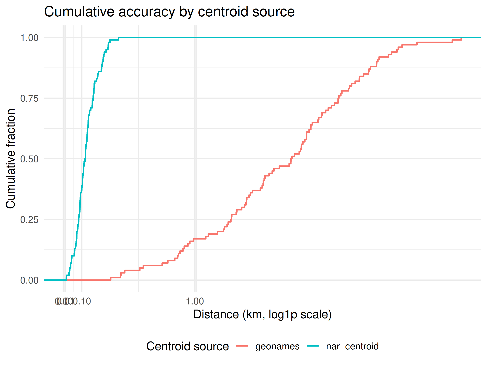
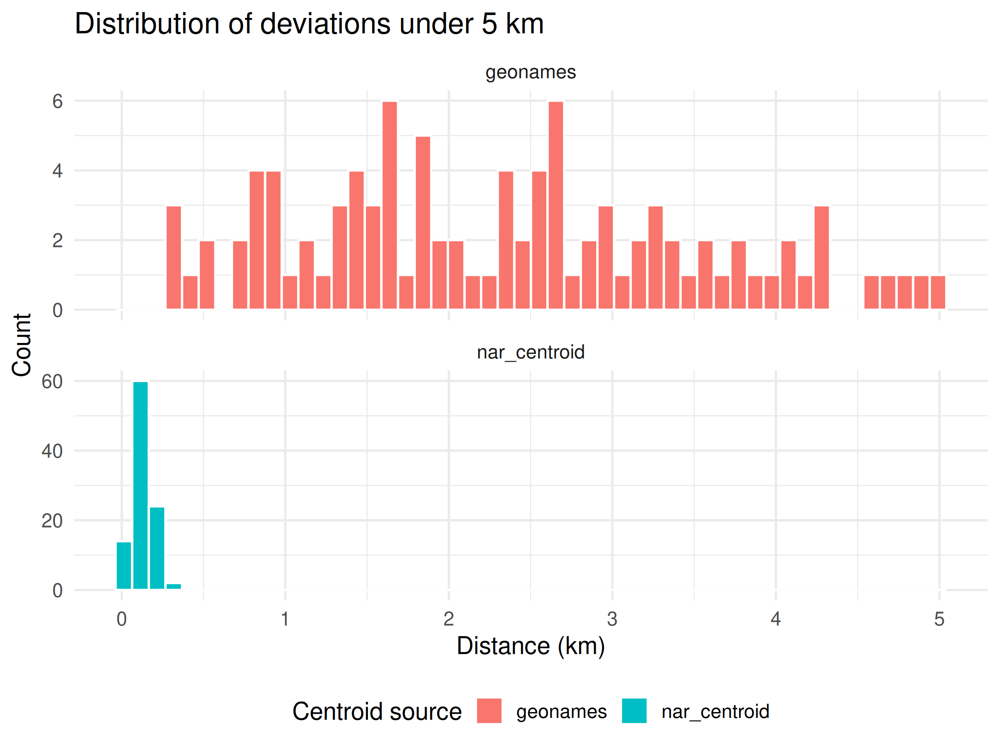
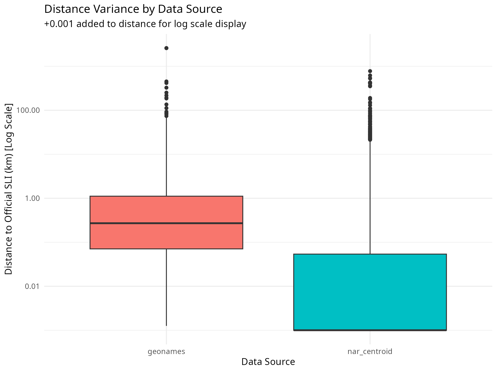

# OPCC Centroid Validation Report

**Mode:** synthetic benchmark
**Centroid artifact:** releases/m1/2026-06-26-nar-geonames-centroids/opcc_m1_centroids.csv.gz
**Centroid manifest:** releases/m1/2026-06-26-nar-geonames-centroids/m1_manifest.json
**Generator commit:** 43d56fc333d8024a2d08efc98d6a8487dbdea28e

## Inputs and boundary

This run used a synthetic benchmark generated from the public centroid table. It demonstrates the validation pipeline and does not assert empirical accuracy against an official PCCF/SLI extract.

The Statistics Canada Postal Code Conversion File (PCCF) and related
SLI extracts contain Canada Post proprietary information. They are used
only as local, read-only QA material under an explicit maintainer exception.
They are not package inputs, release artifacts, contribution evidence, or
redistributed OPCC content. Public users can reproduce the pipeline, but
empirical comparison against an official extract requires their own
authorised access to that restricted input.

## Coverage

- Open-data distinct postal codes: 299,782
- QA distinct postal codes: 200
- Matched postal codes: 200
- Coverage: 100.00 %

## Spatial accuracy

- Matched comparisons: 200
- Median distance: 0.309 km
- Mean distance: 1.287 km
- 90th percentile: 3.540 km
- 95th percentile: 4.240 km
- 99th percentile: 5.494 km
- Max distance: 7.192 km

## Accuracy by centroid source

| point_source | count | median_km | mean_km | p90_km | p95_km | p99_km | max_km |
| :--- | ---: | ---: | ---: | ---: | ---: | ---: | ---: |
| geonames | 100 | 2.336 | 2.446 | 4.242 | 4.833 | 6.818 | 7.192 |
| nar_centroid | 100 | 0.120 | 0.127 | 0.226 | 0.251 | 0.277 | 0.336 |

## Visualisations

All plots are rendered deterministically from the same input set. They
illustrate the validation output and are committed only as documentation.

### Cumulative accuracy (ECDF)

### Distribution of deviations under 5 km

### Distance variance by source

## Result

This is a synthetic benchmark run. See the metrics JSON and manifest for reproducibility metadata.
